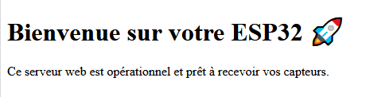

```markdown
# 🌐 Premier test ESP32 : Serveur Web avec WiFi

Ce projet est un mémo personnel pour garder une trace de mon premier test ESP32. Il établit une connexion WiFi, lance un serveur web, et affiche une page HTML simple avec un titre et un texte. Ce sera la base pour des projets plus avancés avec capteurs et interactions web.

---

## 🛠️ Matériel utilisé

- ESP32 Dev Module
- Connexion WiFi locale
- VS Code + PlatformIO

---

## 📂 Structure du projet

Architecture-modulaire-avec-WiFi-et-capteurs-ES

ESP32/
├── data/
│   └── index.html
├── src/
│   └── main.cpp
├── images/
│   └── capture_web.png
├── README.md
└── .gitignore


## 🔌 Étapes de mise en route

1. **Créer le projet PlatformIO dans VS Code**
2. **Écrire le code dans `src/main.cpp`**
3. **Créer la page web dans `data/index.html`**
4. **Téléverser les fichiers SPIFFS**
5. **Flasher le code sur l’ESP32**
6. **Ouvrir l’adresse IP affichée dans le moniteur série**

---

## 📄 Code source : `main.cpp`

```cpp
#include <WiFi.h>
#include <ESPAsyncWebServer.h>
#include <SPIFFS.h>

const char* ssid = "NOM_DU_WIFI";
const char* password = "MOT_DE_PASSE";

AsyncWebServer server(80);

void setup() {
  Serial.begin(115200);

  // Initialisation SPIFFS
  if (!SPIFFS.begin(true)) {
    Serial.println("Erreur SPIFFS");
    return;
  }

  // Connexion WiFi
  WiFi.begin(ssid, password);
  Serial.print("Connexion au WiFi...");
  while (WiFi.status() != WL_CONNECTED) {
    delay(1000);
    Serial.print(".");
  }
  Serial.println("\nConnecté !");
  Serial.println(WiFi.localIP());

  // Route pour la page web
  server.on("/", HTTP_GET, [](AsyncWebServerRequest *request){
    request->send(SPIFFS, "/index.html", "text/html");
  });

  server.begin();
}

void loop() {
  // Rien ici
}
```

---

## 🌐 Code HTML : `data/index.html`

```html
<!DOCTYPE html>
<html>
<head>
  <meta charset="UTF-8">
  <title>Serveur Web ESP32</title>
  <style>
    body {
      font-family: Arial, sans-serif;
      text-align: center;
      margin-top: 50px;
    }
    h1 {
      color: #007ACC;
    }
  </style>
</head>
<body>
  <h1>Bienvenue sur ESP32</h1>
  <p>Ce serveur web fonctionne via WiFi !</p>
</body>
</html>
```

---

## 📸 Capture d’écran

Voici un aperçu de la page web affichée :



---

## 🚀 Prochaines évolutions possibles

- Ajouter des capteurs (DHT22, LDR, etc.)
- Créer une API JSON pour les données
- Intégrer des boutons interactifs dans la page web
- Ajouter du style avec CSS ou animations

---

## 🧠 Notes personnelles

- Le serveur web fonctionne uniquement si l’ESP32 est connecté au WiFi.
- SPIFFS doit être téléversé séparément via PlatformIO (`Upload File System Image`).
- Le port 80 est utilisé par défaut pour le serveur HTTP.

---

## 📅 Date de création

25 août 2025 — Istres, France 🇫🇷
